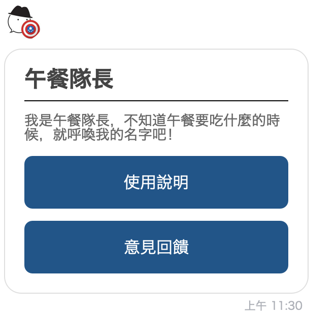
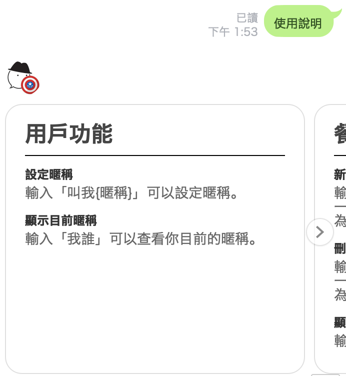
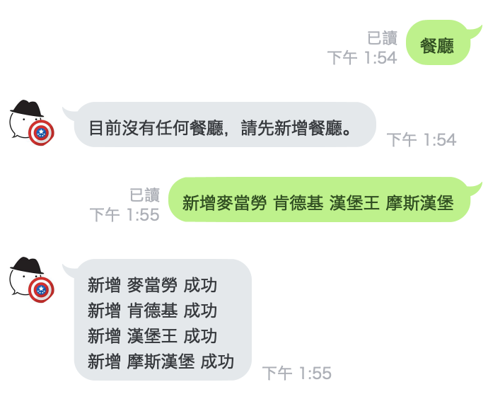
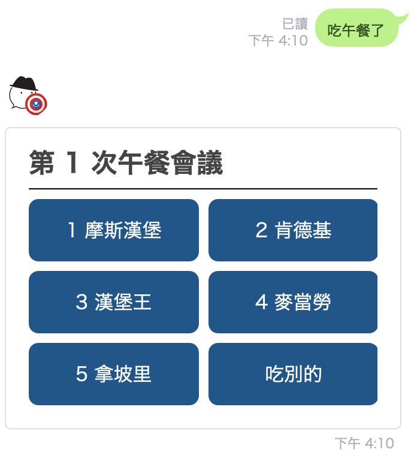
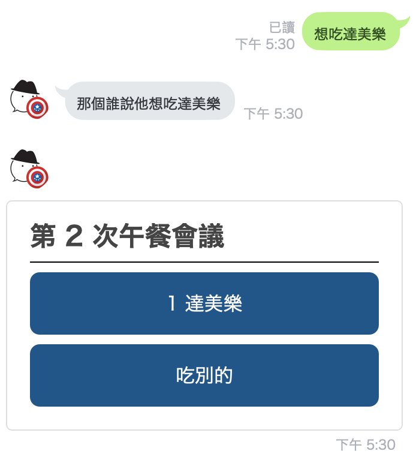
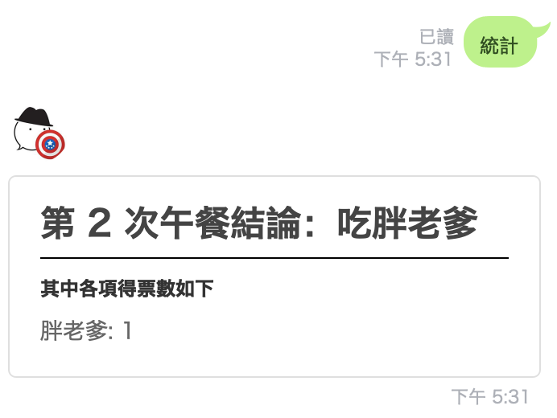

This project was bootstrapped with
[Bottender](https://github.com/Yoctol/bottender) init script.

# Introduction
Leader of lunch is a LINE Bot helping people to make decisions on daily lunch in company.

Scan the following QRCode to add Leader of lunch as your friend.


# Screenshots








# Sending Feedback

Always feel free to open issue to
[Bottender](https://github.com/Yoctol/bottender/issues).

# Setup Steps

To set up the development enviornment. You need to follow the steps:

### clone the repository

```
git clone https://github.com/Yoctol/leader-of-lunch.git
```

### install dependencies

Open a console at the project root path and type the following script to install dependencies:

```
yarn install
```

### install PostgreSQL
In this project, I choose postgreSQL as the database.

```
brew install postgresql
```

### run PostgreSQL server

```
brew services start postgresql
```

### build typescript

Open a new console and typing the following script to auto compile when code changed.

```
tsc -w
```

### setup .env file

```
LINE_ACCESS_TOKEN={ put your line access token here }
LINE_CHANNEL_SECRET= { put your line channel secret here }
TELEGRAM_ACCESS_TOKEN={ put your telegram access token here }

DEBUG=bottender:dialog
NODE_ENV=development
POSTGRESQL_URL=postgresql://:localhost:5432/lol
```

### start the bot server

Open a new console and typing the following script to run a bot server:

```
npx bottender dev
```

### set webhook

After the bot server started, the webhook url will show on the console.
If you are using Telegram bot, you could set the webhook by the following script:

```
npx bottender telegram webhook set
```

If you are using LINE Bot, you could set the webhook by the [LINE Official Account Manager](https://manager.line.biz/).